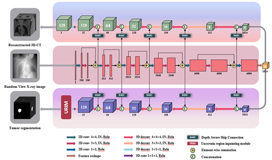
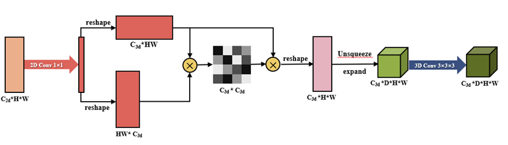
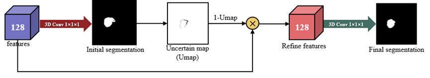

# PatReconSeg
This is the code repository for PatReconSeg.

The Reconstruction Toolkit (RTK) is an open source cross-platform software for rapid cone beam CT reconstruction based on the Insight Toolkit (ITK). RTK is an open source package of CBCT reconstruction algorithms, owned by Kitware, and is based on the ITK package extension. RTK implements many existing CT image reconstruction algorithms, including ADMM, SART, SIRT, POCS, etc.

## Introduction
Our network is structured as follows.
For more details, please read the paper.


The DASC module is shown below.


The URIM module is shown below.



## Install
```sh
$ conda env create -f PatReconSeg.yaml
```

## Train & Test
To train our model, run `train.py`.

To test our model, run `test.py`.
